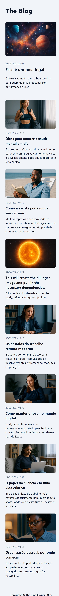
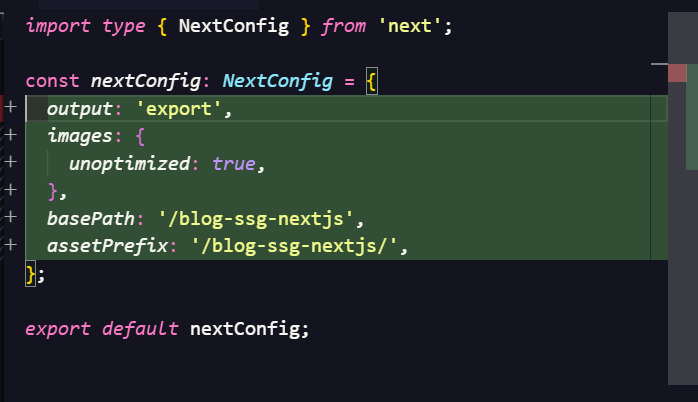

This is a [Next.js](https://nextjs.org) project bootstrapped with
[`create-next-app`](https://nextjs.org/docs/app/api-reference/cli/create-next-app).

## Screenshots

### Desktop


### Mobile



## Getting Started

First, run the development server:

```bash
npm run dev
# or
yarn dev
# or
pnpm dev
# or
bun dev
```

Open [http://localhost:3000](http://localhost:3000) with your browser to see the
result.

You can start editing the page by modifying `app/page.tsx`. The page
auto-updates as you edit the file.

This project uses
[`next/font`](https://nextjs.org/docs/app/building-your-application/optimizing/fonts)
to automatically optimize and load [Geist](https://vercel.com/font), a new font
family for Vercel.

## Banco de Dados

Este projeto utiliza **SQLite** com **Drizzle ORM** para gerenciar os dados. O
banco de dados é criado automaticamente na primeira execução.

### Comandos Disponíveis

```bash
# Gerar migrações (após modificar schemas)
npm run db:generate

# Aplicar migrações ao banco
npm run db:migrate

# Abrir Drizzle Studio (interface visual do banco)
npm run db:studio
```

### Como Resetar e Popular o Banco

#### 1. Resetar o banco completamente

Se você quiser começar do zero, delete o arquivo do banco:

```bash
# No Windows (PowerShell)
Remove-Item db.sqlite3

# No Linux/Mac
rm db.sqlite3
```

Se preferir use `npm run db:generate` após removee migrations

ou executar seed

#### 2. Recriar as tabelas

Após deletar o banco, execute as migrações novamente:

```bash
npm run db:migrate
```

#### 3. Popular com dados iniciais

Execute o script de seed para inserir os dados de exemplo:

```bash
npx tsx src/db/drizzle/seed.ts
```

#### 4. Processo completo (reset + popular)

Para fazer tudo de uma vez:

```bash
# Deletar banco existente
Remove-Item db.sqlite3 -ErrorAction SilentlyContinue

# Recriar tabelas
npm run db:migrate

# Popular com dados
npx tsx src/db/drizzle/seed.ts
```

### Estrutura do Banco

O banco possui uma tabela principal `posts` com os seguintes campos:

- `id` - Identificador único
- `title` - Título do post
- `slug` - URL amigável (único)
- `excerpt` - Resumo do post
- `author` - Autor do post
- `cover_image_url` - URL da imagem de capa
- `content` - Conteúdo completo
- `published` - Status de publicação (booleano)
- `created_at` - Data de criação
- `updated_at` - Data de atualização

### Drizzle Studio

Para visualizar e editar os dados graficamente, execute:

```bash
npm run db:studio
```

Isso abrirá uma interface web em `http://localhost:4983` onde você pode navegar
pelos dados.

## Learn More

To learn more about Next.js, take a look at the following resources:

- [Next.js Documentation](https://nextjs.org/docs) - learn about Next.js
  features and API.
- [Learn Next.js](https://nextjs.org/learn) - an interactive Next.js tutorial.

You can check out
[the Next.js GitHub repository](https://github.com/vercel/next.js) - your
feedback and contributions are welcome!

## Deploy on Vercel

The easiest way to deploy your Next.js app is to use the
[Vercel Platform](https://vercel.com/new?utm_medium=default-template&filter=next.js&utm_source=create-next-app&utm_campaign=create-next-app-readme)
from the creators of Next.js.

Check out our
[Next.js deployment documentation](https://nextjs.org/docs/app/building-your-application/deploying)
for more details.

### Exemplo de configuração em pagina estatica



server action

- utilizar sempre que for mudar algo na base de dados

quebre as sua aplicacao em pequenas componentes para ser especifico o que vai
ser client e servidor, exemplo interacao com o usuario sempre client.
